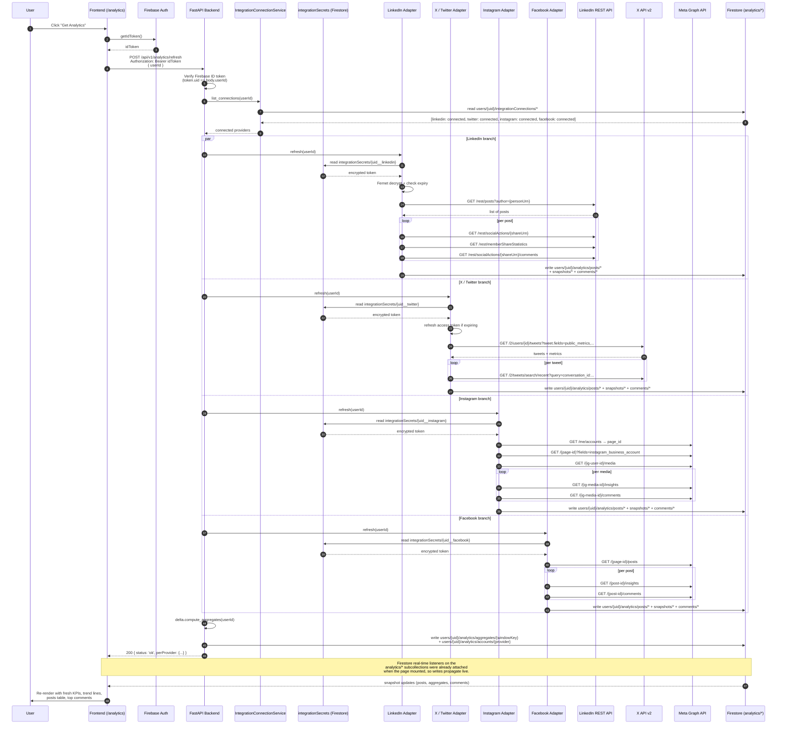

# Analytics Implementation Plan

> **Status:** Architectural blueprint. No code written yet. This document is the contract that subsequent feature-loop / architect / developer runs will implement against.

This document describes how the Marketing Dashboard will pull, store, surface, and refresh post-level analytics from a user's connected social accounts (LinkedIn, X / Twitter, Instagram, Facebook, and — later — Medium / WordPress / Ghost / Substack).

The goal: when a user lands on `/analytics` and clicks **"Get Analytics"**, the dashboard fetches the latest performance data for every post the user has published on every connected platform, stores a time-series snapshot, computes deltas vs. that user's normal, and renders engagement, trend lines, top comments, and platform comparisons.

> **Decision: direct provider APIs, no aggregators.** We register our own apps with LinkedIn, X, and Meta and build four adapters in our FastAPI backend. The reasoning is in §13: at the 100+ user scale this product targets, third-party aggregators (Ayrshare, Phyllo) cost 10–40× more than running our own integration layer because their pricing scales per connected profile while our infrastructure cost is roughly flat.

> **Architecture clarification — we never call provider APIs from the browser.** Every call to LinkedIn / X / Meta goes through our FastAPI backend. The browser only ever talks to (a) our backend, and (b) Firestore for cached results. See §13.3 for why direct-from-browser is not an option.

---

## 1. Goals

What the user must be able to see on `/analytics` after this is built:

1. **Post history** — every post the user has published on any connected platform, with platform badge, publish date, copy preview, and link out to the live post.
2. **Per-post engagement** — views / impressions, reach, likes, comments, shares, click-throughs, saves (where applicable), and a per-platform "engagement rate" computed consistently.
3. **Up-vs-normal deltas** — for each metric, show "X% above your 30-day average" (or below). Per platform AND combined.
4. **Trend lines** — sparkline + full-size charts of impressions, engagement, follower growth across a configurable window (7d / 30d / 90d / custom).
5. **Top comments** — for each post, the highest-engagement comments (by like count and reply count), with a one-click "Reply" action that opens the platform's native compose UI prefilled.
6. **Platform comparison** — side-by-side cards (LinkedIn vs. X vs. Instagram) showing total impressions, total engagement, follower change, top post.
7. **Refresh control** — a "Get Analytics" button forces a synchronous refresh; in the background a daily job keeps the data warm so the page renders instantly on first load.

What we explicitly are **not** building in this first cut:

- Predictive scoring of unpublished drafts (already a separate placeholder card on the page).
- Cross-platform competitor benchmarking.
- Paid-ad analytics (boosted posts on LinkedIn / Meta Ads). Organic only.
- AI-answer-engine visibility tracking (separate roadmap item).

---

## 2. Per-Platform Implementation Detail

This is the most important section because each platform has very different access models, scopes, and review requirements. The dashboard already has OAuth scaffolding for LinkedIn (see `specs/automation.md`); the rest needs to be built on the same pattern.

### 2.1 LinkedIn

**API:** LinkedIn REST API (`https://api.linkedin.com/rest/...`) and the older v2 API for some endpoints.

**Auth:** OAuth 2.0 (already implemented for posting). Re-use the existing token storage in `integrationSecrets/{uid__linkedin}`.

**Scopes already requested:** `openid profile email w_member_social` (publish-only; insufficient for analytics).

**Additional scopes required for analytics:**
- `r_member_social` — read the authenticated member's own posts and basic engagement counts.
- `r_organization_social` — read posts on Pages the user administers (if surfacing company-page analytics).
- `r_organization_admin` — required for organization-level page statistics (follower growth, page views).
- `rw_organization_admin` — only if we ever need to write back; not needed for read-only analytics.

**Endpoints we will hit:**

| Purpose | Endpoint |
|---|---|
| List authored posts (member) | `GET /rest/posts?author={personUrn}&q=author&count=50` |
| List authored posts (org page) | `GET /rest/posts?author={orgUrn}&q=author` |
| Per-post social actions counts (likes/comments/reshares) | `GET /rest/socialActions/{shareUrn}` |
| Comments thread for a post | `GET /rest/socialActions/{shareUrn}/comments` |
| Per-post statistics (impressions, unique impressions, click count) | `GET /rest/memberShareStatistics?q=memberAndShares&shares=List({shareUrn})&member={personUrn}` |
| Org-page time-series stats | `GET /rest/organizationalEntityShareStatistics?q=organizationalEntity&organizationalEntity={orgUrn}` |
| Follower growth | `GET /rest/networkSizes/{personUrn}?edgeType=CompanyFollowedByMember` (for orgs) / member follower count via `userinfo` is approximate only |

**Hard truths / limitations:**
- LinkedIn does **not** expose post-level impression data for personal members through the standard developer program. Member-level impression counts require **LinkedIn Marketing Developer Platform (MDP)** access, which is partner-gated and requires a formal application + use-case review.
- For non-MDP apps, what we can reliably show for personal profiles is: likes, comments, reshares, and the comment thread. For org pages, we get full impressions / unique impressions / click-throughs.
- Versioning: REST API requires the `LinkedIn-Version: YYYYMM` header (we will pin to a known-good version and bump quarterly).
- Rate limit: 100 calls per day per member for read endpoints under the standard tier — design assumes one full sync per day per user, with cached deltas for the in-session "Get Analytics" click.

**What the user has to do:**
- Connect LinkedIn (already wired). On first analytics enable, we will trigger a re-consent flow to add `r_member_social` (and optionally the org scopes if they admin a Page). Settings page surfaces a "Reconnect for analytics" prompt.

### 2.2 X / Twitter

**API:** X API v2 (`https://api.twitter.com/2/...`).

**Auth:** OAuth 2.0 with PKCE. Currently the dashboard does **not** have an OAuth flow for X — this needs to be added (mirror the LinkedIn pattern in `backend/app/services/linkedin_oauth_service.py`).

**Scopes required:**
- `tweet.read` — read the user's tweets.
- `users.read` — read the user's profile + follower count.
- `offline.access` — receive a refresh token (X access tokens expire in 2 hours).

**Endpoints:**

| Purpose | Endpoint |
|---|---|
| List recent tweets by user | `GET /2/users/{id}/tweets?max_results=100&tweet.fields=public_metrics,non_public_metrics,organic_metrics,created_at` |
| Single tweet metrics | `GET /2/tweets/{id}?tweet.fields=public_metrics,non_public_metrics,organic_metrics` |
| Replies to a tweet (top comments) | `GET /2/tweets/search/recent?query=conversation_id:{tweetId}&tweet.fields=public_metrics,author_id` |
| User profile / follower count | `GET /2/users/me?user.fields=public_metrics` |

**Metrics available:**
- `public_metrics` (free, any tier): retweet_count, reply_count, like_count, quote_count, bookmark_count, impression_count.
- `non_public_metrics` (requires user-context auth, paid tier on X API): user_profile_clicks, url_link_clicks.
- `organic_metrics` (paid tier): same fields broken out organically.

**Hard truths:**
- X API has a paywall: **Free** tier is write-only (1500 posts/month, no read). **Basic** tier ($100/month) gives ~10k tweet reads / month with `public_metrics`. **Pro** tier ($5000/month) for `non_public_metrics`.
- For the dashboard to ship analytics for X, the user (or the dashboard operator) must have at least a Basic-tier developer app. This is a deployment requirement, not just a code change. We will gate the X analytics card behind a runtime check of `TWITTER_BEARER_TOKEN` / per-user OAuth + a feature flag.
- Tweet IDs from tweets the user posted *manually* (not through our publish handoff) are still fetchable by listing `/users/{id}/tweets`, so we are not limited to dashboard-published content.

**What the user has to do:**
- Connect X via OAuth 2.0 PKCE flow (new feature). Approve `tweet.read users.read offline.access`. We will store tokens encrypted in `integrationSecrets/{uid__twitter}` exactly like LinkedIn.

### 2.3 Instagram

**API:** Instagram Graph API (Meta) — `https://graph.facebook.com/v19.0/...` (or current).

**Auth:** Facebook Login (OAuth 2.0). The Instagram account must be a **Business** or **Creator** account linked to a Facebook Page the user administers. Personal Instagram accounts are unavailable through this API — we will explicitly tell the user this in Settings.

**Scopes required:**
- `instagram_basic` — read the user's IG account info and media list.
- `instagram_manage_insights` — read per-post insights (impressions, reach, engagement, saves).
- `pages_show_list` — list the Facebook Pages the user administers (needed to find the linked IG account).
- `pages_read_engagement` — read engagement on the Facebook Page (also required for IG insights via Pages).
- `business_management` — only if the user manages multiple businesses (optional in v1).

**Endpoints:**

| Purpose | Endpoint |
|---|---|
| List user's Pages | `GET /me/accounts` |
| Get IG Business account ID linked to Page | `GET /{page-id}?fields=instagram_business_account` |
| List IG media | `GET /{ig-user-id}/media?fields=id,caption,media_type,permalink,timestamp,like_count,comments_count` |
| Per-post insights | `GET /{ig-media-id}/insights?metric=impressions,reach,engagement,saved,video_views` |
| Comments on a media item | `GET /{ig-media-id}/comments?fields=text,username,like_count,timestamp,replies` |
| Account-level insights (follower count, profile views) | `GET /{ig-user-id}/insights?metric=follower_count,profile_views&period=day` |

**Hard truths:**
- Personal IG accounts: **no API access**. We will detect this case during connection and surface a clear "Convert to a Business account in the Instagram app to enable analytics" message.
- App Review: For production use beyond the developer's own test accounts, the Meta app must pass App Review for `instagram_manage_insights` and `pages_read_engagement`. This is a written submission with screencast walkthroughs. **This is a real schedule risk — typically 1–3 weeks.**
- Token lifetime: Long-lived user access tokens are valid for 60 days and require refresh.
- Rate limit: 200 calls per user per hour (per app), tracked by the `X-Business-Use-Case-Usage` header.

**What the user has to do:**
- Have an IG Business or Creator account.
- Link it to a Facebook Page they administer.
- Connect via Facebook Login from `/settings`.
- Approve all four scopes during the consent dialog.

### 2.4 Facebook (Pages)

**API:** Graph API (same Meta endpoint as Instagram).

**Auth:** Facebook Login (same OAuth flow as Instagram — connecting one connects both, since the access token covers both).

**Scopes required (in addition to the Instagram set):**
- `pages_read_engagement` — already in IG set, also covers FB Pages.
- `pages_read_user_content` — read posts on the Page.
- `read_insights` — read Page insights (impressions, reach).

**Endpoints:**

| Purpose | Endpoint |
|---|---|
| List Page posts | `GET /{page-id}/posts?fields=id,message,created_time,permalink_url` |
| Per-post insights | `GET /{post-id}/insights?metric=post_impressions,post_impressions_unique,post_engaged_users,post_clicks,post_reactions_by_type_total` |
| Per-post comments | `GET /{post-id}/comments?fields=message,from,like_count,comment_count` |
| Page-level insights | `GET /{page-id}/insights?metric=page_impressions,page_engaged_users,page_fans&period=day` |

**Hard truths:**
- Same App Review requirement as Instagram for `pages_read_engagement`, `pages_read_user_content`, `read_insights`.
- Personal Facebook profile analytics: **no API**. Pages only.

**What the user has to do:**
- Same flow as Instagram. One Facebook Login covers both. Settings will show one "Connect Meta" button that surfaces both Pages and IG Business accounts after approval.

### 2.5 Future platforms (out of v1 scope, listed for completeness)

| Platform | Approach |
|---|---|
| Medium | No public read API for stats. Would require user to paste in their Medium API integration token (Partner Program), or scrape the stats page (fragile). Skip in v1. |
| WordPress (self-hosted) | Use the WP REST API + a Jetpack stats plugin OR Google Analytics integration. v2. |
| Ghost | Ghost Admin API exposes per-post views. v2. |
| Substack | No official analytics API. Would require email-stats scraping or RSS-based fallback. v3 or never. |
| Threads | Meta is rolling out a Threads API; treat as additive once stable. |
| YouTube / TikTok | Out of scope (the dashboard is text-content-first). |

---

## 3. Backend Architecture

### 3.1 New services

The analytics layer is implemented as a new module in the existing FastAPI backend. No new server process is required — it runs in-process with the existing Uvicorn app.

```
backend/app/
  routers/
    analytics.py                       # NEW. /api/v1/analytics/* endpoints.
  services/
    analytics/
      __init__.py
      orchestrator.py                  # NEW. Runs a refresh across all connected providers for a user.
      storage.py                       # NEW. Reads/writes Firestore analytics collections.
      delta.py                         # NEW. Computes "up X% from normal" using rolling windows.
      adapters/
        base.py                        # NEW. AnalyticsAdapter ABC with fetch_posts() / fetch_post_metrics() / fetch_comments() / fetch_account_metrics().
        linkedin_analytics.py          # NEW. Wraps LinkedIn REST API.
        twitter_analytics.py           # NEW. Wraps X API v2.
        instagram_analytics.py         # NEW. Wraps Meta Graph API for IG.
        facebook_analytics.py          # NEW. Wraps Meta Graph API for FB Pages.
    integration_connection_service.py  # EXTEND. Add helpers to read decrypted tokens for analytics adapters.
```

The orchestrator's job is:
1. Accept `user_id` and (optionally) a list of providers + a force flag.
2. Look up which providers the user has connected via `integration_connection_service.list_connections(user_id)`.
3. For each connected provider, instantiate the matching adapter, decrypt the access token, and call `adapter.refresh(user_id)`.
4. Each adapter writes its results into Firestore via `storage.py`.
5. Return an aggregated overview payload to the caller.

Adapters are independent and isolated. A failure in the LinkedIn adapter does not break the X adapter. Each adapter logs a structured error to `users/{uid}/analytics/errors/{errorId}` so the UI can surface platform-specific failure messages.

### 3.2 Background refresh

The "Get Analytics" button gives an on-demand sync, but most of the time we want data already warm. Two options, and we will start with **Option A** (cheaper, simpler) and migrate to **Option B** if scale demands it.

**Option A — Frontend-triggered refresh on visit (v1).**
When the user lands on `/analytics`, the page checks `users/{uid}/analytics/aggregates/{provider}.lastRefreshedAtMs` for each provider. If older than `STALE_THRESHOLD_MS` (default: 6 hours), the page silently calls the refresh endpoint in the background while rendering cached data.

Pros: zero infrastructure. Works today.
Cons: nothing happens if the user never visits the page; the user pays the latency on visits with stale caches.

**Option B — Scheduled refresh (v2).**
A Cloud Scheduler job (GCP) hits a backend endpoint `POST /api/v1/analytics/cron/refresh-all` once per day. The endpoint iterates every user with at least one connected integration and triggers the same orchestrator path. Authentication via a shared secret header.

Pros: data is always warm; users see instant page loads.
Cons: requires Cloud Scheduler + service-to-service auth; backend cost scales with user count; rate-limit budget per provider must be planned.

**Why not in-process APScheduler?** The FastAPI process restarts on deploy; in-process schedulers lose state. Cloud Scheduler is durable and is the right primitive once we cross ~50 users.

### 3.3 Token refresh

LinkedIn tokens are valid 60 days; X tokens expire in 2 hours; Meta tokens are valid 60 days but require the long-lived exchange. Each adapter's `refresh()` checks `tokenExpiresAtMs - now < 5 minutes` and triggers a refresh-token grant before the API call. Refreshed tokens are written back to `integrationSecrets/{uid__provider}` via `integration_connection_service.upsert_connection(...)`.

If a refresh fails (revoked grant, expired refresh token), the adapter marks the connection as `status: 'expired'` in `users/{uid}/integrationConnections/{provider}` and stops further calls. The frontend renders a "Reconnect to refresh analytics" banner.

### 3.4 Rate limiting and quotas

Each adapter holds a per-user, per-provider semaphore that throttles outbound calls to stay well under the documented limit. Counts are tracked in `users/{uid}/analytics/rateLimits/{provider}` with a daily reset. If a 429 is returned anyway, the adapter records the `Retry-After` header and the orchestrator surfaces a "rate limited; try again in X minutes" message in the response payload — the UI shows it as a soft warning rather than a hard error.

### 3.5 Backend endpoints (new)

All under the existing FastAPI app. Auth: Firebase ID token in `Authorization: Bearer <token>`, validated server-side; `userId` body/query parameter must match the verified UID.

| Method + Path | Purpose |
|---|---|
| `POST /api/v1/analytics/refresh` | Force-refresh now. Body: `{ userId, providers?: string[] }`. Returns `{ status: 'ok' \| 'partial' \| 'error', perProvider: {...} }`. |
| `GET /api/v1/analytics/overview?userId=...` | Aggregate cards (totals + deltas across all providers). Reads from Firestore cache; does not trigger a fetch. |
| `GET /api/v1/analytics/posts?userId=...&provider=...&windowDays=30` | Paginated list of posts with per-post metrics. |
| `GET /api/v1/analytics/posts/{postKey}?userId=...` | Drill-down: full metric history + comments for one post. `postKey = ${provider}__${platformPostId}`. |
| `GET /api/v1/analytics/trends?userId=...&metric=impressions&windowDays=30` | Time-series for trend charts. |
| `GET /api/v1/analytics/comments?userId=...&minLikes=5` | Aggregated top comments across all posts, sorted by engagement. |
| `POST /api/v1/analytics/cron/refresh-all` (v2) | Scheduler-triggered batch refresh. Header-auth only, no UI access. |

---

## 4. Data Storage Design

All under existing Firestore. New collections, all subcollections of `users/{uid}` so the existing per-user security rule (`request.auth.uid == userId`) covers them automatically.

### 4.1 Per-post metric snapshots (time series)

```
users/{uid}/analytics/posts/{postKey}
  postKey: string                      // ${provider}__${platformPostId} — deterministic
  provider: 'linkedin' | 'twitter' | 'instagram' | 'facebook'
  platformPostId: string               // raw ID returned by the provider
  permalink: string                    // canonical URL on the platform
  publishedAtMs: number
  preview: string                      // first ~200 chars of the post copy
  mediaType: 'text' | 'image' | 'video' | 'link' | 'mixed'
  latest: {                            // latest metric snapshot
    impressions: number | null         // null when not available (e.g. LinkedIn personal)
    reach: number | null
    likes: number
    comments: number
    shares: number
    saves: number | null
    clicks: number | null
    engagementRate: number             // (likes + comments + shares) / impressions, or fallback
    fetchedAtMs: number
  }
  ourDraftRef: string | null           // users/{uid}/drafts/{draftId} when the post originated in the dashboard (joined via permalink match)
  createdAtMs: number
  updatedAtMs: number
```

### 4.2 Time-series snapshots (for trend charts)

We keep a separate time-series collection so charts can plot history without re-fetching the platform.

```
users/{uid}/analytics/snapshots/{snapshotId}
  snapshotId: string                   // ${postKey}__${fetchedAtMs} — deterministic
  postKey: string
  provider: string
  fetchedAtMs: number
  metrics: { impressions, reach, likes, comments, shares, saves, clicks }
```

A snapshot is appended on every refresh that produces different values. Snapshots older than 180 days for a given post are pruned by a maintenance job (TODO; not blocking v1).

### 4.3 Account-level metrics (followers, profile views)

```
users/{uid}/analytics/accounts/{provider}
  provider: string
  followerCount: number
  followerCountDelta30d: number        // server-computed
  profileViews30d: number | null
  postsPublished30d: number
  bestPostId: string                   // postKey of top performer in window
  windowImpressionsTotal: number
  windowEngagementTotal: number
  lastRefreshedAtMs: number
```

### 4.4 Top comments (for "respond to comments")

```
users/{uid}/analytics/comments/{commentKey}
  commentKey: string                   // ${provider}__${platformCommentId}
  postKey: string                      // back-reference to the post
  provider: string
  authorDisplayName: string
  authorHandle: string | null          // @-handle on X, vanity on LinkedIn, username on IG/FB
  authorAvatarUrl: string | null
  text: string
  likeCount: number
  replyCount: number
  createdAtMs: number
  permalink: string                    // direct link to the comment on the platform
  fetchedAtMs: number
```

The UI lists them sorted by `likeCount + replyCount * 2` desc and gates on `likeCount >= minLikes` from the query.

### 4.5 Aggregates (the "overview" cards)

```
users/{uid}/analytics/aggregates/{windowKey}
  windowKey: string                    // e.g. '7d', '30d', '90d', 'all'
  byProvider: {
    [provider]: {
      impressionsTotal: number
      engagementTotal: number
      postsCount: number
      avgEngagementRate: number
      vsBaselinePct: number            // rolling baseline = previous equal-length window
    }
  }
  combined: { ... }                    // same shape, summed across providers
  computedAtMs: number
```

These are written by `delta.py` after every refresh. The frontend reads these directly with no further computation.

### 4.6 Errors and rate limits (operational)

```
users/{uid}/analytics/errors/{errorId}
  provider: string
  endpoint: string
  status: number                       // HTTP status from the provider
  message: string
  occurredAtMs: number

users/{uid}/analytics/rateLimits/{provider}
  callsToday: number
  resetsAtMs: number
  retryAfterMs: number | null
```

### 4.7 Firestore rules

The existing rule already covers all of this:

```
match /users/{userId}/{document=**} {
  allow read, write: if request.auth != null && request.auth.uid == userId;
}
```

But: writes to `users/{uid}/analytics/**` happen from the **backend** with Firebase Admin credentials, not the client. The client only reads. To enforce that, we will tighten the rule for analytics specifically:

```
match /users/{userId}/analytics/{document=**} {
  allow read: if request.auth != null && request.auth.uid == userId;
  allow write: if false;   // backend Admin SDK bypasses rules; client cannot write
}
```

This protects the user from accidental client-side writes corrupting their analytics cache.

---

## 5. What The User Has To Do

Concrete, in order, the first time they enable analytics:

1. **Have accounts to connect.** LinkedIn (any), X (any), Instagram (Business or Creator only), Facebook (must admin a Page).
2. **Open Settings → Integrations.** They will see four cards: LinkedIn, X / Twitter, Instagram, Facebook. Each card shows a Connect button. LinkedIn shows "Reconnect for analytics" if they connected previously without the analytics scopes.
3. **Approve the OAuth consent dialog for each platform.** They will see the requested scopes. We will display, on each card, a one-line plain-English summary of what we are asking for ("read your post engagement counts; we never post on your behalf without your action").
4. **For Instagram specifically:** they may need to go into the Instagram app and convert their account to a Business or Creator account, then link it to a Facebook Page. The Settings card will detect a personal account and walk them through this with linkouts.
5. **For X specifically:** if our deployment is on the Free X API tier, the analytics card shows "Limited — X requires a paid developer tier for impression data." We surface what we *can* show (likes, reposts, replies, follower count) and tell the truth about what we can't.
6. **(One time, deployment-side, NOT user-side.)** The dashboard operator must:
   - Register a Meta app and pass App Review for `instagram_manage_insights`, `pages_read_engagement`, `pages_read_user_content`, `read_insights`.
   - Register an X developer project and choose a tier.
   - Apply for LinkedIn Marketing Developer Platform if member-level impressions are required (otherwise standard tier is fine for engagement counts only).

After the user has connected at least one platform, the `/analytics` page becomes useful.

---

## 6. Frontend Integration

### 6.1 Page composition

Replace the existing placeholder cards in `frontend/src/app/(app)/analytics/page.tsx` with:

- **Header bar**: title, last-refreshed timestamp, "Get Analytics" refresh button, window selector (7d / 30d / 90d / all).
- **Overview row**: four KPI cards (Impressions, Engagement, Followers, Posts), each showing total + ▲/▼ delta vs. previous window.
- **Platform comparison row**: one card per connected platform with mini sparkline + top metrics.
- **Trend chart panel**: large line chart with toggleable metric (impressions / engagement / followers), per-platform colored series.
- **Posts table**: paginated list of posts with platform badge, preview, metrics, delta, and a "View comments" expand toggle.
- **Top comments panel**: side panel listing the top comments across all posts with a "Reply" button that opens the platform's native UI.
- **Empty state**: when zero platforms connected, a CTA pointing to `/settings`.
- **Stale state**: when a connected platform's `lastRefreshedAtMs` is older than 24h, an inline "Refresh now" affordance.
- **Error state per platform**: if the latest refresh wrote to `users/{uid}/analytics/errors/`, show a dismissible per-platform banner.

### 6.2 Data fetching pattern

The page uses Firestore real-time listeners to read the cached aggregate + posts collections, exactly like the existing `/dashboard` and `/publish` pages do for `scheduledPosts`. This keeps the read path consistent with the rest of the app and means refreshes initiated from the backend show up live without the page needing to poll.

The "Get Analytics" button calls `POST /api/v1/analytics/refresh` and shows a spinner / progress indicator. As the backend writes new docs, the listener updates the UI in place.

### 6.3 New frontend modules

```
frontend/src/lib/analytics/
  api.ts                  // typed wrappers for /api/v1/analytics/*
  types.ts                // shared TS types matching the Firestore shapes above
  formatters.ts           // metric formatting (1.2K, 3.4M, percentage deltas with up/down arrows)
  windows.ts              // window-key helpers ('7d' | '30d' | ...) + epoch math
  hooks/
    useAnalyticsOverview.ts
    useAnalyticsPosts.ts
    useAnalyticsTrends.ts
    useAnalyticsComments.ts
frontend/src/components/analytics/
  OverviewKPICards.tsx
  PlatformComparisonRow.tsx
  TrendChart.tsx          // wraps recharts (already a TODO-friendly choice; alternatively visx)
  PostsTable.tsx
  TopCommentsPanel.tsx
  RefreshButton.tsx
  WindowSelector.tsx
```

---

## 7. End-to-End Flow When User Clicks "Get Analytics"

The diagram below traces the sequence of calls from the moment the user clicks the button to the moment the dashboard re-renders with fresh data.



If any single branch fails, the orchestrator still completes the others and returns a `partial` status with per-provider error detail. The frontend shows a dismissible error banner per failed platform but renders successful platforms normally.

---

## 8. Implementation Phases

A suggested order, each phase shippable on its own:

1. **Phase 1 — LinkedIn org analytics only.** Re-use the existing OAuth, request the additional scopes, build the LinkedIn adapter and the orchestrator skeleton, build the Firestore collections, ship the `/analytics` overview + posts table for LinkedIn only. ETA: 1 sprint.
2. **Phase 2 — X / Twitter.** New OAuth flow, new adapter. Gate behind feature flag if API tier is uncertain. ETA: 1 sprint after Phase 1.
3. **Phase 3 — Meta (Instagram + Facebook).** Single OAuth, two adapters. Schedule risk on App Review. ETA: 2 sprints.
4. **Phase 4 — Trend charts + top comments + reply handoff.** Polish; UI-heavy. ETA: 1 sprint.
5. **Phase 5 — Background scheduled refresh (Cloud Scheduler).** Move from on-visit to daily warming. ETA: 1 sprint, can run in parallel with Phase 4.
6. **Phase 6 — Predictive scoring + AI visibility.** Out of scope of this document; tracked separately on the analytics roadmap.

---

## 9. Risks and Open Questions

- **Meta App Review timing.** 1–3 weeks unpredictable. Mitigation: start the submission as soon as the IG adapter is functional in dev, in parallel with frontend work.
- **X API pricing.** $100/month minimum for any read access. Decision needed: do we ship X analytics, or skip until the user supplies their own developer credentials? Recommended: skip X impressions in v1, ship engagement-only via the user's own bearer token they paste in Settings.
- **LinkedIn MDP gating.** Member-level impression data is partner-only. v1 will ship engagement counts only for personal profiles and full impressions for org pages the user admins.
- **Storage cost.** Time-series snapshots grow linearly with (posts × refresh frequency). Mitigation: prune snapshots older than 180 days; aggregate to weekly granularity beyond 30 days.
- **Backend performance under sync refresh.** A user with 200 LinkedIn posts triggers ~600 outbound API calls per refresh. Mitigation: bound the per-refresh post count to the most recent N (default 50), and use a "deep refresh" optional path for the rest.
- **Token revocation.** Users will sometimes revoke our app from LinkedIn / Meta / X directly. We need a clear UI signal when refresh fails with `invalid_token`. Already covered in §3.3.
- **Comments at scale.** Highly engaged accounts may have hundreds of comments per post. Mitigation: cap fetch at top 20 by `likeCount`, and offer a "Load more" path that hits the platform API on demand.
- **Real-time listener cost.** Firestore listeners on the analytics subcollections are cheap but not free; we will scope the listener queries to the active window only, not the entire history.

---

## 10. Summary

**What we are building:** A platform-aware analytics surface on `/analytics` that pulls post-level engagement and impression data from the user's connected LinkedIn, X / Twitter, Instagram, and Facebook accounts; stores it as a time-series cache in Firestore; computes deltas vs. each user's rolling baseline; and renders KPI cards, per-platform comparisons, trend lines, a posts table, and a top-comments-with-reply panel.

**How it gets built:**
- **Backend:** A new `analytics` package in the existing FastAPI app, with one orchestrator and four per-provider adapters wired on top of the existing OAuth/integration plumbing. New REST endpoints under `/api/v1/analytics/*` for refresh + reads. Token storage re-uses the existing encrypted `integrationSecrets/` collection; no new credential-handling code.
- **Storage:** Five new Firestore subcollections under `users/{uid}/analytics/` — `posts`, `snapshots`, `accounts`, `comments`, `aggregates` — plus operational `errors` and `rateLimits`. All client-readable, backend-write-only.
- **Frontend:** Replace the placeholder cards on `/analytics` with real KPI cards, charts, posts table, and comment panel, all reading via Firestore real-time listeners so backend refreshes propagate live.
- **Permissions and APIs per platform:**
  - **LinkedIn:** REST API + the existing OAuth flow, with added scopes `r_member_social`, `r_organization_social`, `r_organization_admin`. Member-impression data is gated; engagement counts always available.
  - **X / Twitter:** New OAuth 2.0 PKCE flow with scopes `tweet.read users.read offline.access`. API v2. Requires a paid X developer tier for full metrics; engagement-only fallback on free tier.
  - **Instagram:** Meta Graph API via Facebook Login OAuth; scopes `instagram_basic`, `instagram_manage_insights`, `pages_show_list`, `pages_read_engagement`. Business / Creator accounts only. Requires Meta App Review.
  - **Facebook (Pages):** Same Meta OAuth as Instagram, with extra scopes `pages_read_user_content` and `read_insights`. Requires App Review.
- **No new servers required.** The analytics layer lives in the existing FastAPI process. A second-phase Cloud Scheduler job is optional for daily background warming.
- **What the user has to do:** Connect each platform from `/settings`, approve the consent dialogs, and (for Instagram) ensure they have a Business / Creator account linked to a Facebook Page they admin. Then click "Get Analytics" once.
- **What the operator (us) has to do up front:** Pass Meta App Review for the Insights scopes, pick an X API tier, and optionally apply for LinkedIn Marketing Developer Platform.
- **Flow on click:** `/analytics` button → backend refresh endpoint → orchestrator fans out to all four adapters in parallel → each adapter decrypts the user's token, calls its provider, and writes per-post + comment + aggregate data to Firestore → backend computes deltas → real-time Firestore listeners on the page push the new data into the UI live, with no second client request.

The first shippable slice is **LinkedIn org analytics**: it has the lowest gating risk (we already have OAuth), the richest data (full impressions for Pages), and exercises every layer of the architecture end to end. Each subsequent platform is then an additive adapter behind the same orchestrator and the same Firestore cache.

---

## 11. Setup Checklist — What You (Achint) Must Do Before Any Code Runs

These are tasks that **only you** can do. They cannot be automated, they cannot be done by the developer agent, and most of them have lead times measured in days or weeks (especially Meta App Review). Start the long-lead items first; the code work in §12 can begin in parallel once the LinkedIn additions are complete.

Each item has a clear **Done When** so you know it is finished.

### 11.1 LinkedIn — extend the existing app for analytics scopes

You already have a LinkedIn developer app for the existing publish flow. Reuse it; do not create a new one.

1. **Open your LinkedIn developer app.**
   - Go to https://www.linkedin.com/developers/apps and click your existing Marketing Dashboard app.
   - **Done When:** you see the Auth, Products, and Settings tabs.

2. **Request additional API products.** Under the **Products** tab:
   - Request **"Sign In with LinkedIn using OpenID Connect"** (already approved).
   - Request **"Share on LinkedIn"** (already approved — this gave you `w_member_social`).
   - Request **"Community Management API"** — this is the gate for `r_member_social` (read your own posts) and is the easiest analytics path for personal profiles. It auto-approves for most apps.
   - Request **"Marketing Developer Platform"** *only if* you need member-level impressions (versus engagement counts). This is partner-gated and requires a written application describing your use case. **Lead time: 2–6 weeks.** v1 can ship without this — see §9.
   - **Done When:** the Products tab shows your new product as "Approved" or "In review."

3. **Confirm OAuth scope strings.** Under the **Auth** tab → **OAuth 2.0 scopes**:
   - You should now see (in addition to the existing `openid profile email w_member_social`): `r_member_social`. If you also got Marketing Developer Platform, you will see `r_organization_social`, `r_organization_admin`, `r_ads_reporting`, `rw_organization_admin`.
   - **Done When:** the new scopes are visible in the app config.

4. **Update the backend `.env`.** Edit `backend/.env`:
   ```
   LINKEDIN_SCOPES=openid profile email w_member_social r_member_social
   ```
   Add the org scopes only if you got MDP approval. Do not add scopes the app does not own — the OAuth start call will fail.
   - **Done When:** restarting the backend (`uvicorn app.main:app --reload`) loads without error.

5. **Plan a re-consent for existing connected users.** Existing users connected with the old scopes will not have analytics permission. The Settings page must show them a "Reconnect for analytics" button (this is a code task in §12, but you should be aware that current connected users will need to click through OAuth a second time).

### 11.2 X / Twitter — register a new developer project

Currently the dashboard has no X integration at all. You will create one from scratch.

1. **Sign up for the X developer portal.**
   - Go to https://developer.x.com/en/portal/dashboard.
   - Sign in with the X account you want to own the app (use the company account, not a personal one — this matters for billing).
   - **Done When:** you reach the developer portal home.

2. **Create a Project and an App inside it.**
   - Project name: `Marketing Dashboard`. Use case: "Analyzing the tweets I publish from my own marketing tool."
   - Inside the project, create an App: `Marketing Dashboard Production` (and optionally a `... Dev` app for local development).
   - **Done When:** you have an App with a generated **Client ID** and **Client Secret** for OAuth 2.0.

3. **Choose a tier and pay.** This is unavoidable.
   - **Free** tier: write-only. Will not work for analytics. Skip.
   - **Basic** tier: $100/month. Gives ~10k tweet reads / month and `public_metrics`. **This is the minimum viable tier for shipping X analytics.**
   - **Pro** tier: $5,000/month. Adds `non_public_metrics` (impression breakdowns, profile clicks, URL clicks). Skip unless a customer explicitly needs it.
   - **Recommendation:** start on Basic. Document for users that "X analytics shows engagement counts only" and flag impression numbers as Basic-tier-limited.
   - **Done When:** your project shows "Basic" (or higher) tier and a payment method on file.

4. **Configure the App OAuth 2.0 settings.**
   - Type of App: **Web App, Automated App or Bot** → **Confidential client** (we have a backend secret).
   - Callback URL: `http://localhost:8000/api/v1/auth/twitter/callback` for dev. Add the production URL when you deploy.
   - Website URL: your production marketing dashboard URL (or a placeholder — required field).
   - **Done When:** the app shows OAuth 2.0 enabled with the callback URL listed.

5. **Add the X credentials to the backend `.env`.**
   ```
   TWITTER_CLIENT_ID=...
   TWITTER_CLIENT_SECRET=...
   TWITTER_REDIRECT_URI=http://localhost:8000/api/v1/auth/twitter/callback
   TWITTER_SCOPES=tweet.read users.read offline.access
   ```
   - **Done When:** the values are present (do **not** commit `.env`).

### 11.3 Meta (Instagram + Facebook) — register a Meta app and start App Review

This is the longest-lead item. Start it on day one of the project.

1. **Create a Meta developer account.**
   - Go to https://developers.facebook.com/.
   - Sign in with the Facebook account that has admin access to the Pages and Instagram Business accounts you will test with.
   - **Done When:** you can reach https://developers.facebook.com/apps/.

2. **Create a new Meta app.**
   - App type: **Business**.
   - App name: `Marketing Dashboard`.
   - Connect a Business Manager account (create one at https://business.facebook.com/ if you do not have one).
   - **Done When:** the app appears in your apps list with an **App ID** and **App Secret**.

3. **Add the required products to the app.** From the app dashboard → **Add Products**:
   - **Facebook Login** (required for OAuth).
   - **Instagram Graph API**.
   - **Pages API**.
   - **Done When:** all three appear in the left sidebar of the app dashboard.

4. **Configure Facebook Login.**
   - Valid OAuth Redirect URIs: `http://localhost:8000/api/v1/auth/meta/callback` for dev, plus the production URL.
   - **Done When:** the redirect URI is saved.

5. **Submit for App Review.** This is the long part. You need approval for these permissions:
   - `instagram_basic`
   - `instagram_manage_insights`
   - `pages_show_list`
   - `pages_read_engagement`
   - `pages_read_user_content`
   - `read_insights`
   - `business_management` (optional, only if multi-business support is in v1)

   For each permission, App Review requires:
   - A **screencast video** showing the exact end-to-end flow from a brand-new user account in your app, walking through how that permission is used. Each video should be 1–3 minutes.
   - A **written description** of the use case in plain language.
   - A **test user account** with the data needed to demonstrate the permission (a real IG Business account, a real FB Page).

   - **Lead time:** Meta typically responds in 5–10 business days. If they request changes (likely on first submission), each round adds another 5–10 days. **Plan for 3–4 weeks total.**
   - **Done When:** all required permissions show "Approved" in the App Review tab.

6. **Verify your business.** Some permissions also require Business Verification (uploading documents proving the business exists). Start this in parallel — it can take 1–2 weeks.
   - **Done When:** Business Manager → Security Center shows "Verified."

7. **Add the Meta credentials to the backend `.env`.**
   ```
   META_APP_ID=...
   META_APP_SECRET=...
   META_REDIRECT_URI=http://localhost:8000/api/v1/auth/meta/callback
   META_SCOPES=instagram_basic instagram_manage_insights pages_show_list pages_read_engagement pages_read_user_content read_insights
   ```
   - **Done When:** values are present.

8. **Prepare test accounts for development.**
   - At least one **Instagram Business or Creator** account, linked to a **Facebook Page** you administer, populated with at least 5 recent posts so the analytics adapter has something to read.
   - **Done When:** posting on the IG Business account shows up under `Page → Insights` in business.facebook.com.

### 11.4 Firebase / Firestore — adjust security rules and enable a billing-tier project

The dashboard is already on Firestore. Two adjustments:

1. **Update Firestore security rules.** Edit `firestore.rules` (or wherever rules are managed) to add the analytics rule from §4.7:
   ```
   match /users/{userId}/analytics/{document=**} {
     allow read: if request.auth != null && request.auth.uid == userId;
     allow write: if false;
   }
   ```
   Deploy with `firebase deploy --only firestore:rules`.
   - **Done When:** the Firebase console → Firestore → Rules shows the new block live.

2. **Enable Firestore composite indexes.** Once the code lands, the orchestrator will likely query `users/{uid}/analytics/posts` ordered by `latest.fetchedAtMs desc, provider asc`. Firestore will surface a "create index" link the first time the query runs in dev — click it and let it provision. Repeat for any other compound queries that emerge.
   - **Done When:** the index appears as "Enabled" in the Firestore Indexes tab.

3. **Confirm the Firebase project is on the Blaze (pay-as-you-go) plan.** Free Spark plan has a Firestore read cap that the analytics page will burn through quickly. Charts that listen to time-series snapshots are read-heavy.
   - **Done When:** Firebase Console → Usage & Billing shows "Blaze."

### 11.5 Optional but recommended

1. **Decide on background refresh strategy now.** If you want background warming (§3.2 Option B) on day one:
   - Enable Cloud Scheduler in your GCP project: https://console.cloud.google.com/cloudscheduler.
   - Pick a region (match your FastAPI deployment region).
   - You will configure the actual job once the `/api/v1/analytics/cron/refresh-all` endpoint exists in code.
   - **Done When:** Cloud Scheduler is enabled (no jobs created yet).

2. **Allocate an error-reporting destination.** Adapter failures will write to `users/{uid}/analytics/errors/`, but you should also pipe critical errors to Sentry / Slack for ops visibility. Set up a Sentry project for the backend if you do not already have one.
   - **Done When:** `SENTRY_DSN` is present in `backend/.env` (or a comparable error pipe is configured).

3. **Pre-write the user-facing copy for OAuth consent screens.** Each platform's consent dialog gets a configurable description. Write these once and copy-paste into all three developer portals. Suggested copy:
   > Marketing Dashboard reads your post engagement counts (likes, comments, shares, impressions where available) so you can see how your content is performing. We never post on your behalf without your explicit action, and we never share your data with third parties.
   - **Done When:** the copy is saved into LinkedIn → app description, X → app description, and Meta → app review submission.

### 11.6 Setup-stage Done-When (the gate before §12 code work fully ships)

Before the final code can ship to production, all of the following must be true:

- [ ] LinkedIn app has `r_member_social` scope approved and `LINKEDIN_SCOPES` env updated.
- [ ] X developer project exists, on Basic tier or higher, with OAuth credentials in env.
- [ ] Meta app is created, App Review submitted for the six required permissions.
- [ ] Meta app's Business Verification submitted.
- [ ] Firestore security rules updated and deployed.
- [ ] Firebase project on Blaze plan.
- [ ] Real test accounts exist on each platform with at least 5 recent posts each.

The LinkedIn-only first slice (Phase 1 in §8) only requires items 1, 5, 6, 7. You can begin code work for that slice as soon as those four are done; X and Meta phases gate on their respective items.

---

## 12. Code Implementation Plan — After Setup Is Done

This is the developer-side work, ordered so each step produces a runnable commit. Every step ends with a clear **Verify** action so progress is observable. The phases mirror §8 but here we go file-by-file.

### Phase 1 — Foundation + LinkedIn

#### Step 1.1. Extend the provider registry

**File:** `backend/app/services/provider_registry.py`

Add a new field `supports_analytics: bool` to `ProviderDefinition`. Default `False`. Set it to `True` for `linkedin`, `twitter`, `instagram`, `facebook`. This lets the analytics orchestrator skip providers that have no adapter (Ghost, Substack, etc.).

**Verify:** `GET /api/v1/integrations/providers` includes `supportsAnalytics: true` for LinkedIn.

#### Step 1.2. Add the analytics package skeleton

**Files (new):**
```
backend/app/services/analytics/__init__.py
backend/app/services/analytics/orchestrator.py
backend/app/services/analytics/storage.py
backend/app/services/analytics/delta.py
backend/app/services/analytics/adapters/__init__.py
backend/app/services/analytics/adapters/base.py
```

`base.py` defines an abstract `AnalyticsAdapter` class:
- `provider: str` (slug)
- `async def fetch_posts(self, user_id, since_ms) -> list[NormalizedPost]`
- `async def fetch_post_metrics(self, user_id, post) -> NormalizedMetrics`
- `async def fetch_comments(self, user_id, post, top_n=20) -> list[NormalizedComment]`
- `async def fetch_account_metrics(self, user_id) -> NormalizedAccountMetrics`
- `async def refresh(self, user_id) -> ProviderRefreshResult` — orchestrates the four above and writes to Firestore via `storage.py`.

Define dataclasses for `NormalizedPost`, `NormalizedMetrics`, `NormalizedComment`, `NormalizedAccountMetrics`, `ProviderRefreshResult` in `base.py` so every adapter returns the same shape.

**Verify:** `python -c "from backend.app.services.analytics.adapters.base import AnalyticsAdapter"` imports clean.

#### Step 1.3. Build the storage layer

**File:** `backend/app/services/analytics/storage.py`

Functions:
- `upsert_post(uid, normalized_post)`
- `append_snapshot(uid, post_key, metrics, fetched_at_ms)` — only writes if metrics differ from the last snapshot.
- `upsert_account(uid, provider, account_metrics)`
- `replace_top_comments(uid, post_key, comments)` — full replace each refresh; pruning is implicit.
- `record_error(uid, provider, endpoint, status, message)`
- `update_rate_limit(uid, provider, calls_today, retry_after_ms)`

All write paths use the Firebase Admin SDK already initialized in `firebase_service.py`. All collection paths follow §4.

**Verify:** unit test that calls `upsert_post()` against the Firebase emulator and reads it back. Add the emulator config to `backend/firebase.json` if not already present.

#### Step 1.4. Build the delta computation

**File:** `backend/app/services/analytics/delta.py`

Functions:
- `compute_aggregates(uid, window_keys=['7d','30d','90d','all'])` — reads `users/{uid}/analytics/posts/*`, sums and averages per window, computes `vsBaselinePct` (current window vs. previous equal-length window), writes `users/{uid}/analytics/aggregates/{windowKey}`.
- `compute_account_deltas(uid, provider)` — reads `users/{uid}/analytics/snapshots/*` for that provider, computes follower/post/engagement deltas, updates `users/{uid}/analytics/accounts/{provider}.followerCountDelta30d` etc.

This module is pure-functional given Firestore reads — easy to unit-test.

**Verify:** unit test asserting that 100 fixture posts → expected aggregate totals.

#### Step 1.5. Implement the LinkedIn adapter

**File:** `backend/app/services/analytics/adapters/linkedin_analytics.py`

`LinkedInAnalyticsAdapter(AnalyticsAdapter)`:
- `provider = "linkedin"`
- Decrypt the token via `integration_connection_service` (add a `get_decrypted_access_token(user_id, provider)` helper to that service if it does not already exist).
- `fetch_posts`: call `GET /rest/posts?author={personUrn}&q=author&count=50` with the `LinkedIn-Version` header pinned in `app/config.py`.
- `fetch_post_metrics`: call `GET /rest/socialActions/{shareUrn}` for like/comment/share counts. If org URN, also call `/rest/organizationalEntityShareStatistics` for impressions; for personal URN leave `impressions: None` and rely on the `engagementRate` fallback formula.
- `fetch_comments`: paginate `/rest/socialActions/{shareUrn}/comments?count=20&start=0&sort=RELEVANCE` and map to `NormalizedComment`.
- `fetch_account_metrics`: call `/v2/userinfo` (already in use by the existing OAuth callback) for profile fields; followers via `/rest/networkSizes/{personUrn}` if scoped, else `None`.
- Token refresh logic before any call.

**Verify:** an integration test that hits LinkedIn's sandbox / your own dev account and asserts a non-empty post list.

#### Step 1.6. Implement the orchestrator

**File:** `backend/app/services/analytics/orchestrator.py`

`AnalyticsOrchestrator`:
- `async def refresh_user(self, user_id, providers=None) -> OverallRefreshResult`
- Resolves the connected provider list via `integration_connection_service.list_connections(user_id)` and filters by `supports_analytics=True` and `status='connected'`.
- Instantiates the matching adapter from a registry: `{"linkedin": LinkedInAnalyticsAdapter(), ...}`.
- Runs adapters in parallel using `asyncio.gather(..., return_exceptions=True)` so one failure does not block the others.
- After all adapters complete, calls `delta.compute_aggregates(user_id)`.
- Returns `{ status: 'ok' | 'partial' | 'error', perProvider: {linkedin: {ok, postsFetched, error?}, ...} }`.

**Verify:** call `await orchestrator.refresh_user("dev-uid")` from a one-off Python REPL and check Firestore for the resulting docs.

#### Step 1.7. Wire the FastAPI router

**File (new):** `backend/app/routers/analytics.py`

Endpoints (the full list lives in §3.5; in this step only `/refresh`, `/overview`, `/posts` are required):
- `POST /api/v1/analytics/refresh`
- `GET /api/v1/analytics/overview`
- `GET /api/v1/analytics/posts`

Auth: every endpoint extracts `Authorization: Bearer <idToken>` via a new dependency `verify_firebase_id_token()` (add it to a new `backend/app/auth.py` since the existing routers do not yet have one). Reject if the token is missing, invalid, or its `uid` does not match the `userId` in the request.

Register the router in `backend/app/main.py` next to the existing `linkedin` and `integrations` routers.

**Verify:** `curl -H "Authorization: Bearer $ID_TOKEN" -X POST http://localhost:8000/api/v1/analytics/refresh -d '{"userId":"<uid>"}'` returns `200` with a `perProvider` payload.

#### Step 1.8. Frontend types and API client

**Files (new):**
```
frontend/src/lib/analytics/types.ts          // mirrors §4 Firestore shapes
frontend/src/lib/analytics/api.ts            // typed fetch wrappers around /api/v1/analytics/*
frontend/src/lib/analytics/formatters.ts     // 1.2K, 3.4M, ▲ +12%, ▼ -3% helpers
frontend/src/lib/analytics/windows.ts        // 7d/30d/90d/all helpers
```

`api.ts` exports `triggerAnalyticsRefresh(userId, providers?)`, `fetchOverview(userId, windowKey)`, `fetchPosts(userId, opts)`. All of them attach the Firebase ID token to `Authorization`.

**Verify:** TypeScript builds clean (`npx tsc --noEmit`).

#### Step 1.9. Frontend hooks (Firestore listeners)

**Files (new):**
```
frontend/src/lib/analytics/hooks/useAnalyticsOverview.ts
frontend/src/lib/analytics/hooks/useAnalyticsPosts.ts
```

Both hooks use `onSnapshot` against the relevant Firestore subcollections, return `{ data, loading, error }`, and handle the empty-state (no docs yet → "Click Get Analytics to fetch data").

**Verify:** in a sandbox page, mounting `useAnalyticsOverview()` for a user with seeded analytics docs renders the values.

#### Step 1.10. Replace the `/analytics` page placeholders

**File:** `frontend/src/app/(app)/analytics/page.tsx`

Compose:
- `<RefreshButton />` (calls `triggerAnalyticsRefresh`)
- `<WindowSelector />` (controlled state lifted into the page)
- `<OverviewKPICards />` (consumes `useAnalyticsOverview`)
- `<PostsTable />` (consumes `useAnalyticsPosts`)

Place the existing placeholder cards (Predictive Scoring, Copy Intelligence, AI Visibility) **below** the new live data so we keep the visual roadmap signal but no longer claim it is live.

**Component files (new):**
```
frontend/src/components/analytics/OverviewKPICards.tsx
frontend/src/components/analytics/PostsTable.tsx
frontend/src/components/analytics/RefreshButton.tsx
frontend/src/components/analytics/WindowSelector.tsx
```

**Verify:** open `/analytics` in the browser. Click "Get Analytics." Watch the KPI cards populate live as Firestore listeners receive the writes. The dev server log should show one POST to `/api/v1/analytics/refresh` and zero polling.

#### Step 1.11. Settings page reconnect prompt

**File:** `frontend/src/app/(app)/settings/page.tsx`

Add logic: if the LinkedIn connection's `scopes` array is missing `r_member_social`, show a yellow banner under the LinkedIn card: *"Reconnect LinkedIn to enable analytics."* Clicking it triggers the existing `startLinkedInConnection()` flow (which now requests the new scopes because of step 11.1.4).

**Verify:** an existing connected user (without analytics scope) sees the banner; a freshly-connected user does not.

#### Step 1.12. Sync specs

**Files to update:**
- `specs/backend.md` — append the `/api/v1/analytics/*` endpoints, the new `analytics/` service folder, and the new env vars.
- `specs/database.md` — append §4.1–4.6 collections.
- `specs/frontend.md` — replace the `/analytics` placeholder description with the live page.
- `specs/automation.md` — note the optional Cloud Scheduler refresh job once it ships.

**Verify:** spec files reflect new code.

#### Step 1.13. End-to-end Playwright test

**File (new):** `frontend/tests/analytics.spec.ts`

Scenario: log in as a seeded user with one fixture LinkedIn connection and three fixture posts in Firestore (use the emulator). Click "Get Analytics." Stub the LinkedIn HTTP calls at the network layer using Playwright's `route` API. Assert the KPI cards render the expected totals.

**Verify:** `npm run test:e2e analytics.spec.ts` passes locally.

---

### Phase 2 — X / Twitter

#### Step 2.1. X OAuth backend service

**File (new):** `backend/app/services/twitter_oauth_service.py`

Mirror the structure of `linkedin_oauth_service.py`:
- `TwitterOAuthService` with `start_authorization` and `complete_authorization`.
- Use OAuth 2.0 with PKCE: generate `code_verifier` (base64url-encoded 32 random bytes) and `code_challenge` (SHA-256 of verifier, base64url). Store the verifier in `integrationAuthStates/{sha256(state)}` alongside the existing state metadata.
- Authorize URL: `https://twitter.com/i/oauth2/authorize`.
- Token exchange URL: `https://api.twitter.com/2/oauth2/token`.
- After exchange, call `GET /2/users/me` to capture `accountId` (the numeric user ID) and `displayName`.
- Persist via the existing `integration_connection_service.upsert_connection(...)`.

#### Step 2.2. X OAuth router

**File (new):** `backend/app/routers/twitter.py`
- `POST /api/v1/auth/twitter/start`
- `GET /api/v1/auth/twitter/callback`

Register in `main.py`.

#### Step 2.3. X analytics adapter

**File (new):** `backend/app/services/analytics/adapters/twitter_analytics.py`

`TwitterAnalyticsAdapter(AnalyticsAdapter)`:
- `fetch_posts`: `GET /2/users/{accountId}/tweets?max_results=100&tweet.fields=public_metrics,created_at`.
- `fetch_post_metrics`: included in the list response (`public_metrics`); only call individual `/2/tweets/{id}` if the list response is older than 5 minutes (X aggregates impression counts asynchronously).
- `fetch_comments`: `GET /2/tweets/search/recent?query=conversation_id:{id}&tweet.fields=public_metrics,author_id&max_results=20`. Map to `NormalizedComment`.
- `fetch_account_metrics`: `GET /2/users/me?user.fields=public_metrics`.
- Token refresh before each call (X tokens expire in 2h; refresh is mandatory).

Register in the orchestrator's adapter map.

#### Step 2.4. Frontend Settings card for X

Update `frontend/src/app/(app)/settings/page.tsx` to render an "X / Twitter" connection card alongside LinkedIn, calling `startTwitterConnection()` (add this to `frontend/src/lib/integrations.ts`).

#### Step 2.5. Verify

Connect an X account from `/settings`. Click "Get Analytics." Confirm tweets appear in the posts table with correct like/retweet/reply counts.

---

### Phase 3 — Meta (Instagram + Facebook)

#### Step 3.1. Meta OAuth backend service

**File (new):** `backend/app/services/meta_oauth_service.py`

A single OAuth flow that issues one access token usable for both IG and FB Page reads.
- Authorize URL: `https://www.facebook.com/v19.0/dialog/oauth`.
- Token exchange URL: `https://graph.facebook.com/v19.0/oauth/access_token`.
- After exchange, call `GET /me/accounts` to enumerate the user's Pages and the linked IG Business accounts. Pick the first Page + IG account by default; the Settings UI will allow switching later.
- Persist **two separate** integration connections (one for `facebook`, one for `instagram`) but pointing at the **same** encrypted token in `integrationSecrets/{uid__meta}`. Add a small indirection in `integration_connection_service` to allow shared secrets across providers (or duplicate the encrypted blob — cheaper to duplicate).

#### Step 3.2. Meta OAuth router

**File (new):** `backend/app/routers/meta.py`
- `POST /api/v1/auth/meta/start`
- `GET /api/v1/auth/meta/callback`

Register in `main.py`.

#### Step 3.3. Instagram adapter

**File (new):** `backend/app/services/analytics/adapters/instagram_analytics.py`

`InstagramAnalyticsAdapter(AnalyticsAdapter)`:
- `fetch_posts`: `GET /{ig-user-id}/media?fields=id,caption,media_type,permalink,timestamp,like_count,comments_count`.
- `fetch_post_metrics`: `GET /{ig-media-id}/insights?metric=impressions,reach,engagement,saved` (skip `video_views` for non-video).
- `fetch_comments`: `GET /{ig-media-id}/comments?fields=text,username,like_count,timestamp&limit=20`.
- `fetch_account_metrics`: `GET /{ig-user-id}/insights?metric=follower_count,profile_views&period=day`.

#### Step 3.4. Facebook adapter

**File (new):** `backend/app/services/analytics/adapters/facebook_analytics.py`

`FacebookAnalyticsAdapter(AnalyticsAdapter)`:
- `fetch_posts`: `GET /{page-id}/posts?fields=id,message,created_time,permalink_url`.
- `fetch_post_metrics`: `GET /{post-id}/insights?metric=post_impressions,post_impressions_unique,post_engaged_users,post_clicks,post_reactions_by_type_total`.
- `fetch_comments`: `GET /{post-id}/comments?fields=message,from,like_count,comment_count&limit=20`.
- `fetch_account_metrics`: `GET /{page-id}/insights?metric=page_impressions,page_engaged_users,page_fans&period=day`.

#### Step 3.5. Frontend Settings card for Meta

Single "Connect Instagram & Facebook" card. After OAuth, the Settings page shows two connection rows (one IG, one FB Page) that share a single Disconnect action. If the user has no IG Business account linked, show the "Convert to a Business account" guidance with a linkout to https://help.instagram.com/502981923235522.

#### Step 3.6. Verify

Connect a real IG Business account + linked FB Page. Click "Get Analytics." Confirm both platforms appear in the posts table with the expected media items and metrics.

---

### Phase 4 — Trend charts + top comments + reply handoff

#### Step 4.1. Add the trends endpoint

**File (extend):** `backend/app/routers/analytics.py`
- `GET /api/v1/analytics/trends?userId=...&metric=impressions&windowDays=30&groupBy=day`
- Reads `users/{uid}/analytics/snapshots/*`, downsamples to daily/weekly buckets server-side, returns `{ series: [{ provider, points: [{ tMs, value }] }] }`.

#### Step 4.2. Add the comments endpoint

**File (extend):** `backend/app/routers/analytics.py`
- `GET /api/v1/analytics/comments?userId=...&minLikes=5&limit=20`
- Reads `users/{uid}/analytics/comments/*`, sorts by `likeCount + replyCount * 2`, returns top N.

#### Step 4.3. Trend chart component

**File (new):** `frontend/src/components/analytics/TrendChart.tsx`

Use **recharts** (add `recharts` to `frontend/package.json`). One `<LineChart>` with one `<Line>` per connected provider, color-coded. Toggle metric via a control above the chart. Use the new `useAnalyticsTrends` hook (next step).

#### Step 4.4. Trends + comments hooks

**Files (new):**
```
frontend/src/lib/analytics/hooks/useAnalyticsTrends.ts
frontend/src/lib/analytics/hooks/useAnalyticsComments.ts
```

These hit the new REST endpoints (not Firestore directly) because the trend downsampling is computed server-side.

#### Step 4.5. Top comments panel + reply handoff

**File (new):** `frontend/src/components/analytics/TopCommentsPanel.tsx`

Renders comment cards. Each card has a **Reply** button that:
- For LinkedIn: opens `https://www.linkedin.com/feed/update/{shareUrn}` in a new tab.
- For X: opens `https://twitter.com/intent/tweet?in_reply_to={tweetId}` in a new tab.
- For Instagram and Facebook: opens the comment's `permalink` directly (no compose intent available). Shows a tooltip explaining "Replies must be made in the Instagram / Facebook app."

Clipboard-copies the comment text to make typing a reply faster.

#### Step 4.6. Platform comparison row

**File (new):** `frontend/src/components/analytics/PlatformComparisonRow.tsx`

One card per connected provider with the provider's followers, total impressions in window, top post (link), and a 7-day sparkline. Reads from `users/{uid}/analytics/accounts/{provider}` and a small slice of snapshots.

#### Step 4.7. Verify

Open `/analytics`. Confirm the trend chart renders with at least two providers' lines, comments panel shows real top comments, and clicking Reply opens the correct platform URL.

---

### Phase 5 — Background scheduled refresh (optional but recommended)

#### Step 5.1. Add the cron endpoint

**File (extend):** `backend/app/routers/analytics.py`
- `POST /api/v1/analytics/cron/refresh-all`
- Auth: header `X-Scheduler-Secret` must match `SCHEDULER_SHARED_SECRET` env var. **No** Firebase ID token check (this is a service-to-service call).
- Behavior: paginate every user with at least one connected integration (`SELECT DISTINCT userId FROM integrationConnections WHERE status = 'connected'`). For each user, enqueue an `orchestrator.refresh_user(uid)` call. Throttle to N concurrent users (default 5) to bound provider rate-limit pressure.

#### Step 5.2. Configure Cloud Scheduler

In GCP Console → Cloud Scheduler:
- Job name: `analytics-daily-refresh`.
- Frequency: `0 6 * * *` (06:00 UTC daily — runs once when most users are asleep).
- Target: HTTP POST to your production `/api/v1/analytics/cron/refresh-all`.
- Headers: `X-Scheduler-Secret: <secret>`.
- Retry policy: max 3 attempts, exponential backoff.

#### Step 5.3. Verify

Trigger the Cloud Scheduler job manually from the GCP console. Tail backend logs and watch for one orchestrator run per connected user. Confirm all users' aggregates update within ~10 minutes.

---

### Phase 6 — Hardening

#### Step 6.1. Snapshot pruning job

**File (new):** `backend/app/services/analytics/maintenance.py` + a cron endpoint `POST /api/v1/analytics/cron/prune` running weekly.
- Deletes `users/{uid}/analytics/snapshots/*` older than 180 days.
- Aggregates snapshots between 30–180 days old to weekly granularity (one snapshot per ISO week per post).

#### Step 6.2. Provider rate-limit gating

Each adapter checks `users/{uid}/analytics/rateLimits/{provider}.callsToday` against a hardcoded daily budget at the start of `refresh()` and short-circuits with a `rate_limited` error if exceeded. Resets on `resetsAtMs`.

#### Step 6.3. Retry-After honor

When a provider returns 429, the adapter writes the `Retry-After` header into `users/{uid}/analytics/rateLimits/{provider}.retryAfterMs` and the orchestrator surfaces it in the response. The frontend shows "Try again in X minutes" instead of a generic error.

#### Step 6.4. Sentry / error surfacing

Hook adapter exceptions into Sentry (configured in §11.5.2). Each error gets a tag `provider:linkedin|twitter|instagram|facebook` so dashboards can split error rates per platform.

#### Step 6.5. Analytics for the analytics

Track in your own internal metrics:
- Number of refreshes per user per day.
- Median refresh latency per provider.
- Provider error rate.
- Daily Firestore read/write counts attributable to the analytics page.

Use this to decide whether to expand or restrict the refresh budget in step 6.2.

---

### 12.7 Sequencing summary

| Phase | What ships | Setup gate (§11) |
|---|---|---|
| 1 | LinkedIn-only analytics, working `/analytics` page, Get Analytics button | §11.1, §11.4 |
| 2 | Adds X / Twitter | §11.2 |
| 3 | Adds Instagram + Facebook | §11.3 (Meta App Review approved) |
| 4 | Trend charts, top comments, reply handoff, platform comparison | none new |
| 5 | Daily background refresh via Cloud Scheduler | §11.5.1 |
| 6 | Pruning, rate-limit gating, error surfacing, observability | §11.5.2 |

Phase 1 should land in approximately one development sprint once §11.1 is complete. Phases 2 and 3 each require their own setup completion before code work can finish, but the code scaffolding (adapter shell, OAuth router skeleton) can land behind a feature flag while you wait on platform approvals — so reviewers and the playwright-tester can validate the orchestrator wiring against fixtures before real platform calls go live.

---

## 13. Architectural Decision Record — Aggregators Rejected

This section captures **why we are using direct provider APIs and not a third-party aggregator**, so the question does not need to be re-debated by future contributors.

### 13.1 What was evaluated

| Service | URL | What it offers |
|---|---|---|
| **Ayrshare** | https://www.ayrshare.com | Single REST API normalizing LinkedIn, X, Instagram, Facebook, TikTok, YouTube, Pinterest, Reddit, Bluesky, Threads, GMB. Per-profile pricing. |
| **Phyllo** | https://www.getphyllo.com | Creator-focused: IG, TikTok, YouTube, Twitch, X. Custom enterprise pricing. |
| **Iconosquare**, **Hootsuite**, **Sprout Social** | (their own platforms) | Mostly end-user products with secondary APIs. Not serious contenders. |

The realistic candidate was Ayrshare — it had the right shape (programmatic, per-profile auth, normalized analytics endpoints) and fronts the Meta App Review work.

### 13.2 Why we rejected the aggregator path

**Per-profile pricing does not scale to our user count.** Ayrshare and similar services charge per connected social profile. Our target is **100+ users**, with each user typically connecting 2–4 platforms. That puts us at 200–400+ profiles, each priced individually.

Cost comparison at our target scale:

| | Direct APIs (DIY) | Aggregator (Ayrshare) |
|---|---|---|
| Recurring fixed cost | ~$100/mo (X Basic tier — platform paywall, unavoidable) | ~$100/mo (X cost bundled in) |
| Backend hosting | ~$50/mo (FastAPI, already running) | ~$50/mo (still need a backend to hold our API key) |
| Per-profile fee | $0 — Firestore reads/writes are negligible | $5–$20 per profile per month (varies by tier) |
| **At 100 users (~300 profiles)** | **~$150/mo flat** | **~$1,500–$6,000/mo and growing** |
| At 500 users (~1,500 profiles) | ~$200/mo (Firestore I/O scales sub-linearly with cache hits) | ~$7,500–$30,000/mo |
| At 1,000 users | ~$250/mo | ~$15,000–$60,000/mo |

The DIY path is **10–40× cheaper at our launch scale**, and the gap **widens linearly** with every new user we add. Aggregators are priced for low-volume internal-tool use cases, not multi-tenant SaaS at our intended scale.

**Secondary reasons that reinforced the decision:**

- **Vendor lock-in.** A unified normalized response shape becomes a hard dependency. If Ayrshare raises prices, deprecates a metric, or has an outage, we're stuck.
- **Black-box debugging.** When a metric looks wrong, we'd be debugging through a vendor's abstraction instead of looking at the platform's own response. We lose the ability to inspect raw payloads.
- **Metric set ceiling.** Aggregators expose the lowest common denominator. Anything platform-specific (LinkedIn organization page demographics, X conversation_id branching, Meta video retention curves) would require the direct API anyway.
- **One-time pain vs. recurring tax.** Meta App Review is the main thing the aggregator buys us out of. It is a one-time 3–4 week wait, not a recurring cost. Trading a one-time setup tax for a perpetual per-user fee is exactly the wrong direction at our scale.

**The decision is therefore: build direct adapters. Plan in §2–§12 stands.**

### 13.3 Why the browser never calls provider APIs directly

This is unrelated to the aggregator decision — it's a universal architectural constraint that holds for any data-fetching path.

1. **CORS.** LinkedIn REST API, Meta Graph API, and X API v2 all reject browser origins. A `fetch()` from our frontend is blocked before the request leaves the browser.

2. **Token confidentiality.** OAuth tokens are bearer credentials: anyone holding them can impersonate the user. We store them encrypted at rest in Firestore (`integrationSecrets/`) and decrypt them only in the backend with the Fernet key. Putting a decrypted token in `localStorage` exposes it to any XSS bug, any misbehaving browser extension, and any user who opens DevTools.

3. **Confidential client + refresh tokens.** LinkedIn, Meta, and X all classify our app as a *confidential client* in OAuth terms — the token-exchange and refresh calls require `client_secret`. That secret cannot ship to the browser without becoming public.

The data path is therefore always: **browser → FastAPI (`/api/v1/analytics/refresh`) → decrypt token → provider API → Firestore write → browser reads from Firestore via real-time listener.**

The only browser-to-platform direct interaction is the **OAuth consent screen** itself — the user is redirected to `linkedin.com` / `facebook.com` / `twitter.com` to type their password and approve the app, then the browser is redirected back to *our* backend's callback URL with a one-time `code`. The browser never sees the resulting access token.

### 13.4 If this decision should ever be revisited

Re-open the question only if all of these are true:

- We are below ~30 active users and unlikely to grow significantly.
- Meta App Review has stalled for >6 weeks despite resubmissions and is blocking a hard deadline.
- A specific aggregator's pricing has materially changed (e.g. flat-rate per-app pricing instead of per-profile).
- We have audited that the aggregator exposes 100% of the metrics in §4.1.

In that case, the orchestrator / storage / delta / frontend layers in §12 are reusable as-is — only the per-platform adapter files would be replaced by a single vendor adapter. The cost of the swap is roughly 1 week of dev work.

Until those conditions hold, the answer is direct APIs.
